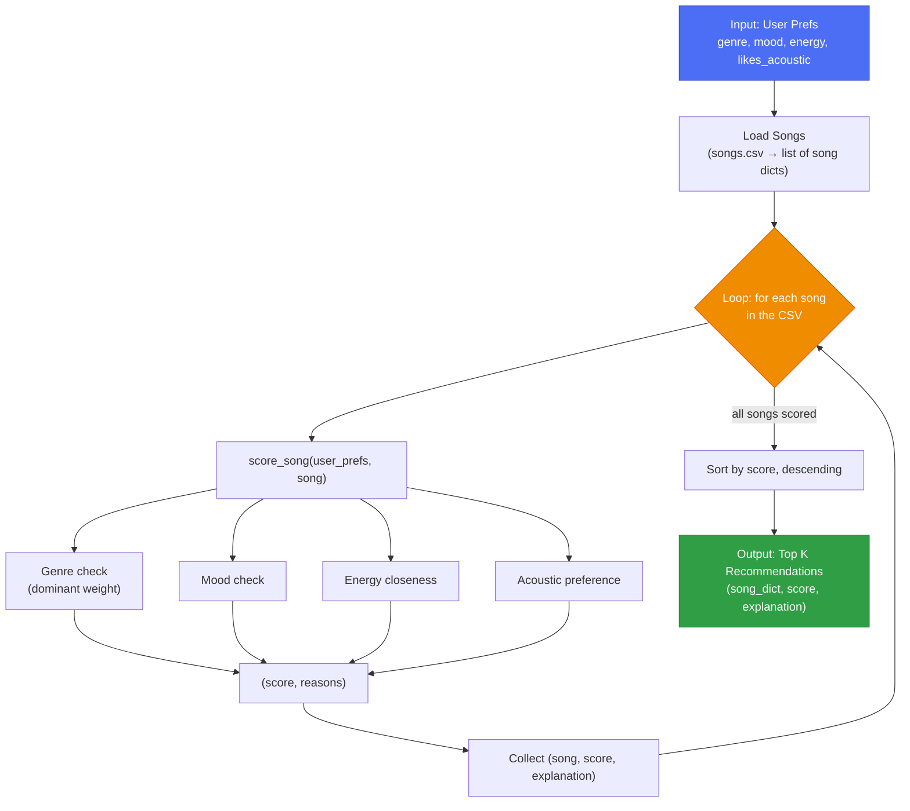

# 🎵 Music Recommender Simulation

## Project Summary

In this project you will build and explain a small music recommender system.

Your goal is to:

- Represent songs and a user "taste profile" as data
- Design a scoring rule that turns that data into recommendations
- Evaluate what your system gets right and wrong
- Reflect on how this mirrors real world AI recommenders

Replace this paragraph with your own summary of what your version does.

---

## How The System Works

Each `Song` carries: `genre`, `mood`, `energy`, `tempo_bpm`, `valence`, `danceability`, and `acousticness`. A user's taste is captured as `user_prefs`: `genre`, `mood`, `energy`, and `likes_acoustic`.

Recommending is a three-step pipeline: load the catalog, score every song against the user's prefs, then rank and keep the top K:



### Algorithm Recipe

`score_song(user_prefs, song)` combines four weighted signals:

| Signal | Weight | Rule |
|---|---|---|
| Genre | `0.60` | Full weight on exact match. Mismatch subtracts half the weight (`-0.30`) **unless** the song's energy is within `0.05` of the user's target energy, in which case it gets a small partial credit (`0.15`) instead of the penalty. |
| Mood | `0.20` | Full weight on exact match, otherwise `0`. |
| Energy | `0.15` | Scaled by `1 - |song.energy - user.energy|`, so closer energy always scores higher, even on a genre/mood match. |
| Acoustic preference | `0.05` | Rewarded when `likes_acoustic` agrees with whether `acousticness >= 0.5`. |

Genre dominates the score by design: the system should stay "on topic" and rarely recommend outside a user's stated genre unless the vibe (energy) is nearly identical. `recommend_songs` scores the entire catalog, sorts descending, and returns the top `k` as `(song_dict, score, explanation)`, where `explanation` is built from the reasons collected during scoring.

### Potential Biases

- **Genre dominance can overfit taste**: weighting genre this heavily means a user who logs one favorite genre may rarely see cross-genre songs that they'd actually enjoy, since the system optimizes for staying "on-brand" over discovery.
- **Popularity/catalog bias**: songs are scored independently with no notion of collaborative signal (what similar users liked), so niche or new songs with no plays are treated identically to popular ones. The catalog itself determines what's reachable, so underrepresented genres in `songs.csv` are structurally disadvantaged regardless of a user's fit.
- **Attribute bias**: relying on `mood`/`genre` labels assumes those tags are accurate and unambiguous; mislabeled or subjective tags (e.g. "chill" vs "relaxed") would silently misscore songs with no way for the system to self-correct.

---

## Getting Started

### Setup

1. Create a virtual environment (optional but recommended):

   ```bash
   python -m venv .venv
   source .venv/bin/activate      # Mac or Linux
   .venv\Scripts\activate         # Windows

2. Install dependencies

```bash
pip install -r requirements.txt
```

3. Run the app:

```bash
python -m src.main
```

### Running Tests

Run the starter tests with:

```bash
pytest
```

You can add more tests in `tests/test_recommender.py`.

---

## Sample Recommendation Output

Output of `python -m src.main`, run against the full `data/songs.csv` catalog for the default profile plus a few deliberately varied personas:

```
Loaded songs: 18

============================================================
Recommendations for: Default (Pop / Happy)
Profile: genre=pop, mood=happy, energy=0.8, likes_acoustic=False
============================================================
1. Sunrise City - Neon Echo  (Score: 4.48)
     - genre match (pop) (+2.0)
     - mood match (happy) (+1.0)
     - energy closeness (+0.98)
     - acoustic preference match (+0.5)

2. Gym Hero - Max Pulse  (Score: 3.37)
     - genre match (pop) (+2.0)
     - energy closeness (+0.87)
     - acoustic preference match (+0.5)

3. Rooftop Lights - Indigo Parade  (Score: 2.96)
     - outside your usual pop genre, but energy is nearly identical (+0.5)
     - mood match (happy) (+1.0)
     - energy closeness (+0.96)
     - acoustic preference match (+0.5)

4. Forget - DJ Yilaguan  (Score: 2.00)
     - outside your usual pop genre, but energy is nearly identical (+0.5)
     - energy closeness (+1.00)
     - acoustic preference match (+0.5)

5. They Don't Know - Disciples  (Score: 1.95)
     - outside your usual pop genre, but energy is nearly identical (+0.5)
     - energy closeness (+0.95)
     - acoustic preference match (+0.5)

============================================================
Recommendations for: Soft Rock Nostalgic
Profile: genre=rock, mood=nostalgic, energy=0.55, likes_acoustic=True
============================================================
1. Sunset Highway - Voltline  (Score: 2.68)
     - genre match (rock) (+2.0)
     - energy closeness (+0.68)

2. Storm Runner - Voltline  (Score: 2.64)
     - genre match (rock) (+2.0)
     - energy closeness (+0.64)

3. I Wish - Casper Mcfadden & Manapool  (Score: 2.50)
     - outside your usual rock genre, but energy is nearly identical (+0.5)
     - mood match (nostalgic) (+1.0)
     - energy closeness (+1.00)

4. Dark Doom Honey - Kyoto  (Score: 0.40)
     - genre mismatch (dream pop) (-1.0)
     - energy closeness (+0.90)
     - acoustic preference match (+0.5)

5. Midnight Coding - LoRoom  (Score: 0.37)
     - genre mismatch (lofi) (-1.0)
     - energy closeness (+0.87)
     - acoustic preference match (+0.5)
```

The default `pop`/`happy` profile ranks "Sunrise City" (pop, happy, energy 0.82) first, exactly as expected, since it's the closest genre, mood, and energy match in the catalog.

**Screenshot or video** *(optional)*: <!-- Insert a screenshot or demo video link here -->

---

## Experiments You Tried

Use this section to document the experiments you ran. For example:

- What happened when you changed the weight on genre from 2.0 to 0.5
- What happened when you added tempo or valence to the score
- How did your system behave for different types of users

---

## Limitations and Risks

Summarize some limitations of your recommender.

Examples:

- It only works on a tiny catalog
- It does not understand lyrics or language
- It might over favor one genre or mood

You will go deeper on this in your model card.

---

## Reflection

Read and complete `model_card.md`:

[**Model Card**](model_card.md)

Write 1 to 2 paragraphs here about what you learned:

- about how recommenders turn data into predictions
- about where bias or unfairness could show up in systems like this


