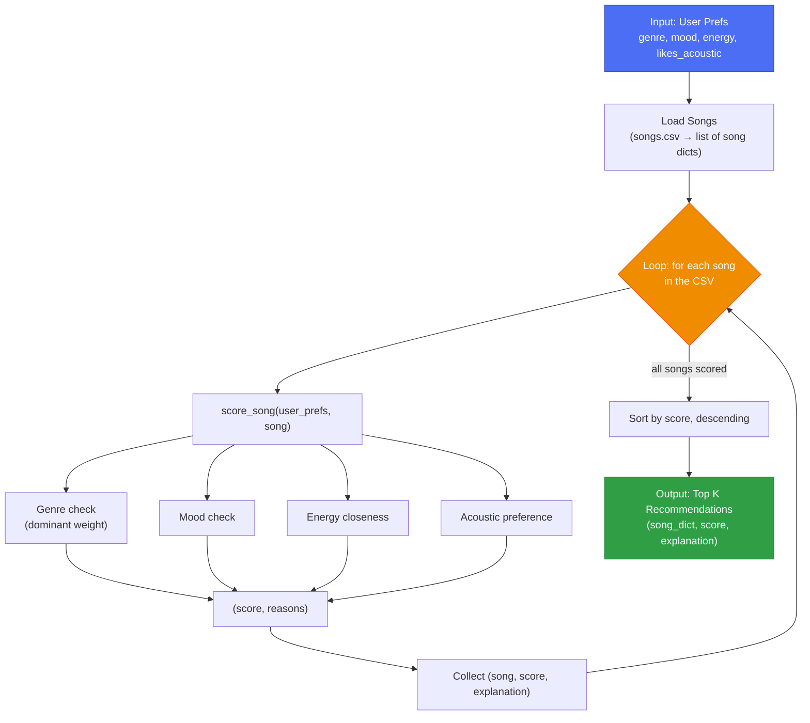

# 🎵 Music Recommender Simulation

## Project Summary

In this project you will build and explain a small music recommender system.

Your goal is to:

- Represent songs and a user "taste profile" as data
- Design a scoring rule that turns that data into recommendations
- Evaluate what your system gets right and wrong
- Reflect on how this mirrors real world AI recommenders

This version loads an 18-song catalog from `data/songs.csv`, scores every song against a user's stated genre, mood, target energy, and acoustic preference with a weighted point rule, and returns the top 5 highest-scoring songs with an itemized explanation of why each one ranked where it did. See "Sample Recommendation Output" below for real runs across 5 personas plus 3 adversarial edge cases, and `model_card.md` for a full write-up of strengths, biases, and evaluation.

---

## How The System Works

### Real-World Context

Real streaming platforms like Spotify and YouTube typically blend two different techniques. **Collaborative filtering** predicts what you'll like based on the behavior of *other* users with similar taste (their likes, skips, playlists, and listening history) - it needs a large base of other people's data and doesn't care what a song actually sounds like. **Content-based filtering** predicts what you'll like based on the attributes of the items themselves (genre, tempo, mood, valence, danceability) compared against your own stated or inferred preferences - it needs no other users at all, just metadata plus one profile.

This simulation is a pure content-based recommender: there are no user accounts, listening history, or other listeners to learn from, so `score_song` compares only the attributes already present in `songs.csv` (genre, mood, energy, acousticness) against one user's explicitly stated preferences. It prioritizes being transparent and explainable (every score comes with itemized reasons) over the kind of large-scale, implicit pattern-matching real collaborative systems rely on.

A recommender needs both a **Scoring Rule** and a **Ranking Rule** because they solve different problems. The Scoring Rule (`score_song`) judges one song in isolation; on its own, a single score can't tell you what to play next; it only says how well that one song fits. The Ranking Rule (the `sorted(...)` call inside `recommend_songs`) is what turns a pile of independent, unordered scores into an actual ordered list, which is the only way to decide which few songs out of the whole catalog should be surfaced first.

### Data Model

Each `Song` carries: `genre`, `mood`, `energy`, `tempo_bpm`, `valence`, `danceability`, and `acousticness`. A user's taste is captured as `user_prefs`: `genre`, `mood`, `energy`, and `likes_acoustic`.

Recommending is a three-step pipeline: load the catalog, score every song against the user's prefs, then rank and keep the top K:



### Algorithm Recipe

`score_song(user_prefs, song)` combines four weighted signals:

| Signal | Weight | Rule |
|---|---|---|
| Genre | `0.60` | Full weight on exact match. Mismatch subtracts half the weight (`-0.30`) **unless** the song's energy is within `0.05` of the user's target energy, in which case it gets a small partial credit (`0.15`) instead of the penalty. |
| Mood | `0.20` | Full weight on exact match, otherwise `0`. |
| Energy | `0.15` | Scaled by `1 - |song.energy - user.energy|`, so closer energy always scores higher, even on a genre/mood match. |
| Acoustic preference | `0.05` | Rewarded when `likes_acoustic` agrees with whether `acousticness >= 0.5`. |

Genre dominates the score by design: the system should stay "on topic" and rarely recommend outside a user's stated genre unless the vibe (energy) is nearly identical. `recommend_songs` scores the entire catalog, sorts descending, and returns the top `k` as `(song_dict, score, explanation)`, where `explanation` is built from the reasons collected during scoring.

### Potential Biases

- **Genre dominance can overfit taste**: weighting genre this heavily means a user who logs one favorite genre may rarely see cross-genre songs that they'd actually enjoy, since the system optimizes for staying "on-brand" over discovery.
- **Popularity/catalog bias**: songs are scored independently with no notion of collaborative signal (what similar users liked), so niche or new songs with no plays are treated identically to popular ones. The catalog itself determines what's reachable, so underrepresented genres in `songs.csv` are structurally disadvantaged regardless of a user's fit.
- **Attribute bias**: relying on `mood`/`genre` labels assumes those tags are accurate and unambiguous; mislabeled or subjective tags (e.g. "chill" vs "relaxed") would silently misscore songs with no way for the system to self-correct.

---

## Getting Started

### Setup

1. Create a virtual environment (optional but recommended):

   ```bash
   python -m venv .venv
   source .venv/bin/activate      # Mac or Linux
   .venv\Scripts\activate         # Windows
   ```

2. Install dependencies

```bash
pip install -r requirements.txt
```

3. Run the app:

```bash
python -m src.main
```

### Running Tests

Run the starter tests with:

```bash
pytest
```

You can add more tests in `tests/test_recommender.py`.

### Bonus: Audio Playback (Experimental)

`src/play.py` is a small, separate module that "plays" a song through the system's real audio output via PyAudio (it synthesizes a short tone in memory, since the simulation has no actual audio files) and records each play in `data/plays.json` per user. `play_score()` turns a user's raw play count into a 0-1 familiarity score, capped so a heavily-replayed song doesn't dominate.

This is exploratory and **not currently wired into `score_song`/`recommend_songs`**: play counts are tracked but don't affect any recommendation yet. It's a plausible next step toward a hybrid recommender (blending this project's content-based scoring with a lightweight collaborative signal), left here as a foundation rather than a finished feature. To try it directly:

```python
from src.play import load_song_request, play_song

play_song(load_song_request(song_id=1))
```

---

## Sample Recommendation Output

Output of `python -m src.main`, run against the full `data/songs.csv` catalog (18 songs) for 5 baseline personas plus 3 adversarial edge-case profiles designed to try to "trick" the scorer:

```
Loaded songs: 18

============================================================
Recommendations for: Default (Pop / Happy)
Profile: genre=pop, mood=happy, energy=0.8, likes_acoustic=False
============================================================
1. Sunrise City - Neon Echo  (Score: 4.48)
     - genre match (pop) (+2.0)
     - mood match (happy) (+1.0)
     - energy closeness (+0.98)
     - acoustic preference match (+0.5)

2. Gym Hero - Max Pulse  (Score: 3.37)
     - genre match (pop) (+2.0)
     - energy closeness (+0.87)
     - acoustic preference match (+0.5)

3. Rooftop Lights - Indigo Parade  (Score: 2.96)
     - outside your usual pop genre, but energy is nearly identical (+0.5)
     - mood match (happy) (+1.0)
     - energy closeness (+0.96)
     - acoustic preference match (+0.5)

4. Forget - DJ Yilaguan  (Score: 2.00)
     - outside your usual pop genre, but energy is nearly identical (+0.5)
     - energy closeness (+1.00)
     - acoustic preference match (+0.5)

5. They Don't Know - Disciples  (Score: 1.95)
     - outside your usual pop genre, but energy is nearly identical (+0.5)
     - energy closeness (+0.95)
     - acoustic preference match (+0.5)

============================================================
Recommendations for: Soft Rock Nostalgic
Profile: genre=rock, mood=nostalgic, energy=0.55, likes_acoustic=True
============================================================
1. Sunset Highway - Voltline  (Score: 2.68)
     - genre match (rock) (+2.0)
     - energy closeness (+0.68)

2. Storm Runner - Voltline  (Score: 2.64)
     - genre match (rock) (+2.0)
     - energy closeness (+0.64)

3. I Wish - Casper Mcfadden & Manapool  (Score: 2.50)
     - outside your usual rock genre, but energy is nearly identical (+0.5)
     - mood match (nostalgic) (+1.0)
     - energy closeness (+1.00)

4. Dark Doom Honey - Kyoto  (Score: 0.40)
     - genre mismatch (dream pop) (-1.0)
     - energy closeness (+0.90)
     - acoustic preference match (+0.5)

5. Midnight Coding - LoRoom  (Score: 0.37)
     - genre mismatch (lofi) (-1.0)
     - energy closeness (+0.87)
     - acoustic preference match (+0.5)

============================================================
Recommendations for: EDM Raver
Profile: genre=house, mood=energetic, energy=0.9, likes_acoustic=False
============================================================
1. They Don't Know - Disciples  (Score: 4.45)
     - genre match (house) (+2.0)
     - mood match (energetic) (+1.0)
     - energy closeness (+0.95)
     - acoustic preference match (+0.5)

2. Sunset Highway - Voltline  (Score: 2.97)
     - outside your usual house genre, but energy is nearly identical (+0.5)
     - mood match (energetic) (+1.0)
     - energy closeness (+0.97)
     - acoustic preference match (+0.5)

3. Storm Runner - Voltline  (Score: 1.99)
     - outside your usual house genre, but energy is nearly identical (+0.5)
     - energy closeness (+0.99)
     - acoustic preference match (+0.5)

4. IYKTYK - Eem Triplin  (Score: 1.98)
     - outside your usual house genre, but energy is nearly identical (+0.5)
     - energy closeness (+0.98)
     - acoustic preference match (+0.5)

5. Gym Hero - Max Pulse  (Score: 1.97)
     - outside your usual house genre, but energy is nearly identical (+0.5)
     - energy closeness (+0.97)
     - acoustic preference match (+0.5)

============================================================
Recommendations for: Lofi Chill Studier
Profile: genre=lofi, mood=chill, energy=0.35, likes_acoustic=True
============================================================
1. Library Rain - Paper Lanterns  (Score: 4.50)
     - genre match (lofi) (+2.0)
     - mood match (chill) (+1.0)
     - energy closeness (+1.00)
     - acoustic preference match (+0.5)

2. Midnight Coding - LoRoom  (Score: 4.43)
     - genre match (lofi) (+2.0)
     - mood match (chill) (+1.0)
     - energy closeness (+0.93)
     - acoustic preference match (+0.5)

3. Focus Flow - LoRoom  (Score: 3.45)
     - genre match (lofi) (+2.0)
     - energy closeness (+0.95)
     - acoustic preference match (+0.5)

4. Quiet Library - Paper Lanterns  (Score: 3.45)
     - genre match (lofi) (+2.0)
     - energy closeness (+0.95)
     - acoustic preference match (+0.5)

5. Coffee Shop Stories - Slow Stereo  (Score: 1.98)
     - outside your usual lofi genre, but energy is nearly identical (+0.5)
     - energy closeness (+0.98)
     - acoustic preference match (+0.5)

============================================================
Recommendations for: Hip-Hop Head
Profile: genre=hip-hop, mood=nostalgic, energy=0.6, likes_acoustic=False
============================================================
1. I Wish - Casper Mcfadden & Manapool  (Score: 2.95)
     - outside your usual hip-hop genre, but energy is nearly identical (+0.5)
     - mood match (nostalgic) (+1.0)
     - energy closeness (+0.95)
     - acoustic preference match (+0.5)

2. Char - Crystal Castles  (Score: 0.40)
     - genre mismatch (electronic) (-1.0)
     - energy closeness (+0.90)
     - acoustic preference match (+0.5)

3. Night Drive Loop - Neon Echo  (Score: 0.35)
     - genre mismatch (synthwave) (-1.0)
     - energy closeness (+0.85)
     - acoustic preference match (+0.5)

4. Rooftop Lights - Indigo Parade  (Score: 0.34)
     - genre mismatch (indie pop) (-1.0)
     - energy closeness (+0.84)
     - acoustic preference match (+0.5)

5. Forget - DJ Yilaguan  (Score: 0.30)
     - genre mismatch (dance) (-1.0)
     - energy closeness (+0.80)
     - acoustic preference match (+0.5)

============================================================
Recommendations for: Adversarial: Hyped But Sad
Profile: genre=pop, mood=sad, energy=0.95, likes_acoustic=None
============================================================
1. Gym Hero - Max Pulse  (Score: 2.98)
     - genre match (pop) (+2.0)
     - energy closeness (+0.98)

2. Sunrise City - Neon Echo  (Score: 2.87)
     - genre match (pop) (+2.0)
     - energy closeness (+0.87)

3. Storm Runner - Voltline  (Score: 1.46)
     - outside your usual pop genre, but energy is nearly identical (+0.5)
     - energy closeness (+0.96)

4. IYKTYK - Eem Triplin  (Score: -0.07)
     - genre mismatch (hyperpop) (-1.0)
     - energy closeness (+0.93)

5. Sunset Highway - Voltline  (Score: -0.08)
     - genre mismatch (rock) (-1.0)
     - energy closeness (+0.92)

============================================================
Recommendations for: Adversarial: Unrepresented Genre
Profile: genre=classical, mood=chill, energy=0.4, likes_acoustic=True
============================================================
1. Midnight Coding - LoRoom  (Score: 2.98)
     - outside your usual classical genre, but energy is nearly identical (+0.5)
     - mood match (chill) (+1.0)
     - energy closeness (+0.98)
     - acoustic preference match (+0.5)

2. Focus Flow - LoRoom  (Score: 2.00)
     - outside your usual classical genre, but energy is nearly identical (+0.5)
     - energy closeness (+1.00)
     - acoustic preference match (+0.5)

3. Coffee Shop Stories - Slow Stereo  (Score: 1.97)
     - outside your usual classical genre, but energy is nearly identical (+0.5)
     - energy closeness (+0.97)
     - acoustic preference match (+0.5)

4. Dark Doom Honey - Kyoto  (Score: 1.95)
     - outside your usual classical genre, but energy is nearly identical (+0.5)
     - energy closeness (+0.95)
     - acoustic preference match (+0.5)

5. Library Rain - Paper Lanterns  (Score: 1.45)
     - genre mismatch (lofi) (-1.0)
     - mood match (chill) (+1.0)
     - energy closeness (+0.95)
     - acoustic preference match (+0.5)

============================================================
Recommendations for: Adversarial: Max Energy Extreme
Profile: genre=lofi, mood=chill, energy=1.0, likes_acoustic=False
============================================================
1. Midnight Coding - LoRoom  (Score: 3.42)
     - genre match (lofi) (+2.0)
     - mood match (chill) (+1.0)
     - energy closeness (+0.42)

2. Library Rain - Paper Lanterns  (Score: 3.35)
     - genre match (lofi) (+2.0)
     - mood match (chill) (+1.0)
     - energy closeness (+0.35)

3. Focus Flow - LoRoom  (Score: 2.40)
     - genre match (lofi) (+2.0)
     - energy closeness (+0.40)

4. Quiet Library - Paper Lanterns  (Score: 2.30)
     - genre match (lofi) (+2.0)
     - energy closeness (+0.30)

5. Gym Hero - Max Pulse  (Score: 0.43)
     - genre mismatch (pop) (-1.0)
     - energy closeness (+0.93)
     - acoustic preference match (+0.5)
```

The default `pop`/`happy` profile ranks "Sunrise City" (pop, happy, energy 0.82) first, exactly as expected, since it's the closest genre, mood, and energy match in the catalog.

The three adversarial profiles were chosen to probe specific weak points in the scoring rule:

- **"Hyped But Sad"** sets `mood: sad` with `energy: 0.95`, a combination that almost never co-occurs in real music (few songs are simultaneously that energetic and that sad). No mood match is possible in the catalog at that energy level, so the top results are pure genre + energy plays with no mood bonus. This confirms the mood signal fails silently (contributes 0, no error) rather than distorting the ranking when it can't be satisfied.
- **"Unrepresented Genre"** asks for `genre: classical`, which does not exist anywhere in `songs.csv`. Since every song mismatches, the ranking collapses entirely to the "close energy" exception path (+0.5) plus mood/energy/acoustic - the system quietly falls back to "closest vibe" instead of failing or returning nothing, which is reasonable but means a user with a genuinely unsupported taste gets recommendations that look confident despite zero genre relevance.
- **"Max Energy Extreme"** sets `energy: 1.0`, the highest possible value. Because `ENERGY_MAX_POINTS` scales linearly with `1 - |diff|`, this profile is well-behaved (no boundary bugs at the extreme), but it does surface that a genre-mismatched, low-energy song can still outrank nothing else in a thin catalog - here the mismatch penalty is large enough that "Gym Hero" still lands 5th place with a low score.

**Screenshot or video** *(optional)*: <!-- Insert a screenshot or demo video link here -->

---

## Experiments You Tried

**Weight shift: doubled energy, halved genre.** As a sensitivity test, `ENERGY_MAX_POINTS` was temporarily changed from `1.0` to `2.0` and `GENRE_MATCH_POINTS` from `2.0` to `1.0` (energy up to 2x its normal weight, genre down to half), then `python -m src.main` was re-run across all 8 profiles.

Result: the change made recommendations **different, not more accurate**. The clearest case is "Soft Rock Nostalgic" (`genre=rock, mood=nostalgic, energy=0.55`). With the original weights, the #1 result is "Sunset Highway" (an actual rock song). With energy doubled and genre halved, the #1 result flips to "I Wish," a song that is **not rock at all** - it wins purely because its energy is nearly identical to the target and it happens to match mood, while the genre penalty is no longer strong enough to keep off-genre songs out of first place. The same pattern showed up in the "Default (Pop / Happy)" profile, where an off-genre song ("Rooftop Lights") jumped ahead of an actual pop song ("Gym Hero") in the ranking.

This confirms the original design intent described in the Algorithm Recipe above: genre needs to dominate the score, or the recommender stops feeling "on-topic" and starts recommending songs from the wrong genre just because their energy happens to line up. The weight shift was reverted after the experiment; the shipped `recommender.py` keeps the original weights.

---

## Limitations and Risks

- It only works on a tiny, 18-song catalog with 1-2 songs per genre, so "top 5" is often just "every song sharing your genre" rather than a real ranking among alternatives.
- It has no concept of a genre it doesn't recognize: a user asking for an unsupported genre (e.g. `classical`) still gets a confident-looking top 5, with no signal that the system has zero real matches for them.
- It does not understand lyrics, audio, or language; it only compares labeled metadata (genre, mood, energy, acousticness) to a stated preference.
- It over-favors genre by design, which keeps recommendations "on-topic" but means a user's mood or acoustic preference can be silently overridden or ignored if genre and energy already line up.

See `model_card.md` for the full write-up of these limitations, including the adversarial profiles and weight-shift experiment that surfaced them.

---

## Reflection

[**Model Card**](model_card.md)

This project made it concrete how a recommender turns a handful of stated preferences into predictions: it is not "understanding" taste at all, just checking a few labeled attributes (genre, mood, energy, acousticness) against a song and adding up points. That mechanical simplicity is also where bias shows up. Genre dominates the score by design, so a user whose favorite genre has thin or zero catalog coverage (tested with the "Hip-Hop Head" and "Unrepresented Genre" profiles) still gets a confident top 5, built entirely from the "close energy" fallback rather than any real genre match. The full evaluation, biases, and personal reflection are documented in `model_card.md`.


